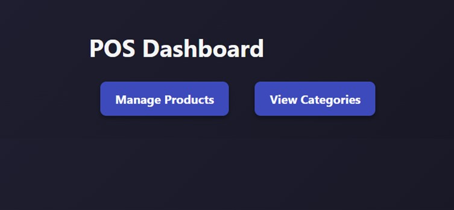

# POS Management System

A modern **Point of Sale (POS) Management System** built with Node.js, PostgreSQL, and a JavaScript frontend. This project provides full CRUD functionality for products and categories, along with a clean, responsive user interface.

---

## 🛠️ Tech Stack

- **Backend:** Node.js, Express.js  
- **Database:** PostgreSQL  
- **Frontend:** HTML, CSS, JavaScript, jQuery  
- **API Documentation:** Swagger (OpenAPI)  

---

## 🗂️ Project Structure
```
POS-SYSTEM/
│
├─ backend/
│ ├─ controllers/
│ │ ├─ productController.js
│ │ └─ categoryController.js
│ ├─ routes/
│ │ ├─ productRoutes.js
│ │ └─ categoryRoutes.js
│ ├─ config/
│ │ ├─ db.js
│ │ └─ swagger.js
│ ├─ server.js
│ └─ package.json
│
├─ frontend/
│ ├─ css/
│ │ └─ style.css
│ ├─ js/
│ │ ├─ api.js
│ │ ├─ products.js
│ │ └─ categories.js
│ ├─ product.html
│ └─ category.html
│ └─ index.html
├─ README.md
├─ db_schema
└─
```

---

## ⚡ Features

- **Product Management:** Add, update, delete, and list products  
- **Category Management:** View categories and associated products  
- **Real-time API calls:** AJAX-based CRUD functionality  

---

## 🖼️ Screenshots

### Frontend Interface
  
*Product management interface with add/update/delete functionality.*

  
*Product management interface with add/update/delete functionality.*

  
*Category listing with products per category.*


---

## 🚀 Getting Started

1. **Clone the repository**
```bash
git clone https://github.com/yourusername/POS-SYSTEM.git
cd POS-SYSTEM
npm install

# Configure database
# Create a PostgreSQL database POS
# Run SQL scripts to create products and categories tables

# Run the backend
cd product-backend
npm start


# Run the frontend
cd ../product-frontend
npx serve
```
